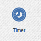

.. _ticker-element:

Ticker
======

The ticker element generates a configured event at configured rate.

This element is used to trigger an action periodically, like check for absense
of events, alarms when something takes longer than expected etc.
