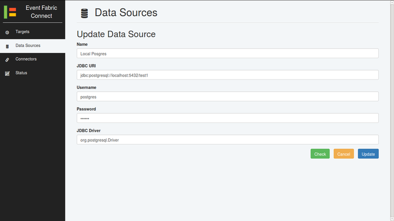

Event Fabric Connect
====================

Event Fabric Connect is a standalone component you can download and run on your
own computer or on a server, it allows the consumption of events that are not
accessible from the internet or directly from the browser and for that reason
need to be sent to Event Fabric before they can be used.

.. note::

    Event Fabric Connect is currently in Beta, if you have any problem please
    contact us and we will help you solve your problem as soon as we can.

Requirements
------------

* Java Runtime 1.7 or higher

  + On windows visit `java.com <https://www.java.com/>`_ for installers

* Windows, Linux or Mac OS X
* A Modern Web Browser

  + Firefox
  + Chrome
  + Internet Explorer 11
  + Microsoft Edge
  + Safari

Installing
----------

The download is a zip file, just extract it's content on any folder.

Running
-------

On windows double click run.bat or run it from a command line tool.

On a unix like system you can run run.sh to run the server in the foreground or
use start-service.sh and stop-service.sh to run it as a service.

On successful execution it should display a message similar to::

    Starting with Configuration:
    {"server" {"host" "0.0.0.0", "port" 8081},
     "auth"
     {"username" "admin",
      "secret" "******",
      "password" "******",
      "token_duration_hours" 1}}

    Event Fabric Connect available from this machine at

    http://localhost:8081/index.html

    To access from another machine
    replace localhost for this machine's IP address or hostname

Now you can open the page http://localhost:8081/index.html to access Event Fabric Connect,
the default credentials are:

Username
    admin
Password
    secret

You can change them by editing the config.toml file with a text editor and
restarting Event Fabric Connect.

Usage
-----

You can see Event Fabric Connect being used to integrate several sources in this videos:

* `Event Fabric Connect Apache Kafka Support  <https://www.youtube.com/watch?v=4NBTJN_nGHk>`_
* `Event Fabric Business Dashboard Demo  <https://www.youtube.com/watch?v=rmiXV576Bio>`_ 
* `Event Fabric Connect Integration: SQL, MQTT, HTTP/JSON and IRC  <https://www.youtube.com/watch?v=OhQPF3vquCY>`_

Supported Connectors
--------------------

Each connector is a plugin on Event Fabric connect, new ones can be easily added,
if you need one that is not available on this list, contact us and we will see
the best way to integrate it.

The currently supported connectors are:

* Email

  + IMAP and IMAPS

* HTTP Requests
* IRC
* JMS
* JMX
* Apache Kafka
* MQTT
* RabbitMQ
* SNMP
* SQL

  + Supports any database with a JDBC driver

Overview
--------

    Login Page

Provide username and password configured in config.toml file to log in.

    Status Page

The status page displays status messages for Event Fabric Connect as they happen.

    Connector List

Overview of configured connectors, this page provides the following actions:

Create Connector
    Using the `Create Connector` button

Start All Connectors
    Using the `Start All` button

Stop All Connectors
    Using the `Stop All` button

Filter Connectors in List
    Writing a filter for the connectors in the filter input

Sort Connectors by Column
    By clicking on the column titles to change or disable column sorting order.
    Sorting can be a combination of more than one column, the order or sorting
    and priority is displayed by an icon (order) and a number (priority)

Edit Connector
    Using the `Edit` button on a connector row

Start/Stop Connector
    Using the `Start/Stop` button on a connector row

Remove Connector
    Using the `Remove` button on a connector row, a connector must be stopped
    to be removed

View Connector Metrics
    The `Events` and `Errors` columns update once a minute with metrics for each route

    Update Connector

    New Connector

    Data Source List

Overview of configured data sources, a data source is a configuration used
while creating connectors that query databases, the configuration specify the
connection configuration for the database where the query for the connector
will run.

This allows to reuse configuration from one data source for many connectors.

This page provides the following actions:

Create Data Source
    Using the `Create Data Source` button

Filter Data Sources in List
    Writing a filter for the connectors in the filter input

Sort Data Sources by Column
    By clicking on the column titles to change or disable column sorting order.
    Sorting can be a combination of more than one column, the order or sorting
    and priority is displayed by an icon (order) and a number (priority)

Edit Data Source
    Using the `Edit` button on a data source row

Check Connector
    Using the `Check` button on a data source row to check if the configuration
    works

    Update Data Source

    Create Data Source

    Target List

Overview of configured targets, a target is a configuration that is used when
creating connectors, it specifies to which instance of Event Fabric, to which
user and stream the events for that connector will go to.

This page provides the following actions:

Create Target
    Using the `Create Target` button

Filter Targets in List
    Writing a filter for the connectors in the filter input

Sort Targets by Column
    By clicking on the column titles to change or disable column sorting order.
    Sorting can be a combination of more than one column, the order or sorting
    and priority is displayed by an icon (order) and a number (priority)

Edit Target
    Using the `Edit` button on a target row

Check Connector
    Using the `Check` button on a target row to check if the configuration
    works

    Update Target

    Create Target

Troubleshooting
---------------

If you have a problem using Event Fabric Connect please contact us via email
at info@event-fabric.com and we will help you solve it.
