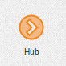

.. _hub-element:

Hub
===

The hub element received an event from any of it sources and sends it to all
of it's targets.

This element is only to organize the connections and avoid having "many to
many" connections, for example having one source, one ticker and one state
loader connected to 3 transformers. Without a hub it would require 9
connections, with a hub it will require 6.
