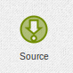

.. _source-element:

Source
======

A source is an element that makes events available to Event Fabric, at the moment
the supported sources are:

* Event Fabric Source
* Sample Source

Other sources will be added in the future via apps that can be activated when
needed per dashboard.

.. _source:

Event Fabric Source
-------------------

This can be considered the standard event source, to configure you have to
specify a channel and a username, after configuring, any event sent to that
channel and by that username will be emitted by that source element.

.. _samplesource:

Sample Event Source
-------------------

Used to generate events without an actual source, mainly to prototype a
dashboard or try something new.

.. _selected:

Event Selected
--------------

This source emits an event each time an event is clicked on a widget which
supports event selection (like news ticker, table etc.).

.. _selected-filter:

Event Selected with Filter
--------------------------

This source emits an event each time an event is clicked on a widget which
supports event selection (like news ticker, table etc.), before emitting the
event it filters the ones that are not in the filter list.
