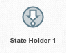

.. _state-holder-element:

State Holder
============

An state holder is an element that allows you to generate a new event based in the acumulation and preprocessing of multiple event from the same or different sources.
