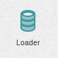

.. _state-element:

State
=====

The state element loads a configured number of events from a set of specified
sources. When the dashboard loads, events are loaded, sorted by the time they
were originally received and sent to the connected elements.

This is done to "replay" events when the dashboard loads to fill it before
sources start receiving events.

At the moment the supported states elements are:

* Event History
* Sample Event History
* Store Query

Event History
-------------

This can be considered the standard state element, to configure you have to specify a channel, username and the number of events you want to load when the dashboard starts.

Sample Event History
--------------------

Used to generated a number of 50 fake events when the dashboard loads. Mainly to prototype a dashboard or try something new.
