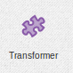
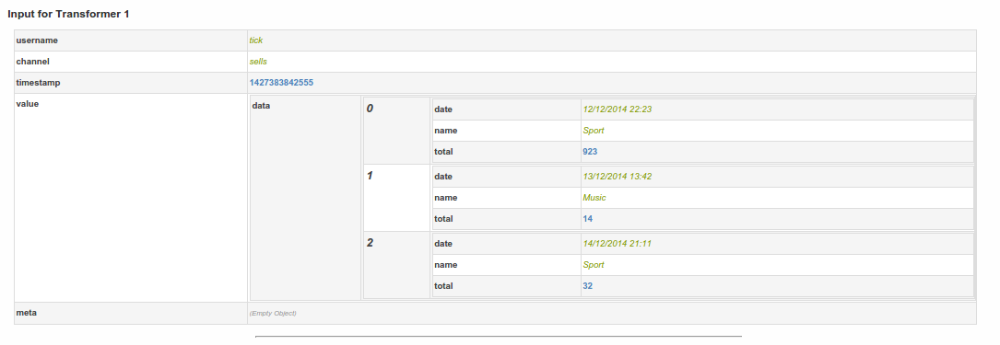
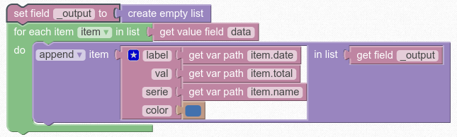
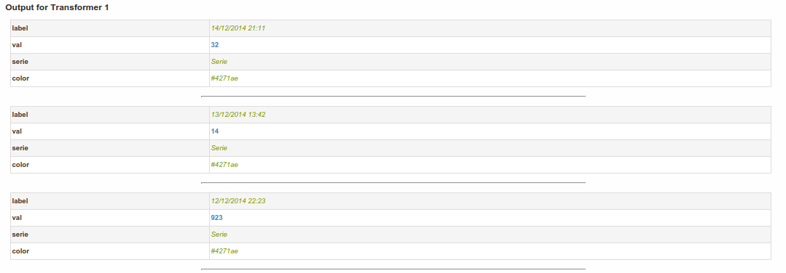
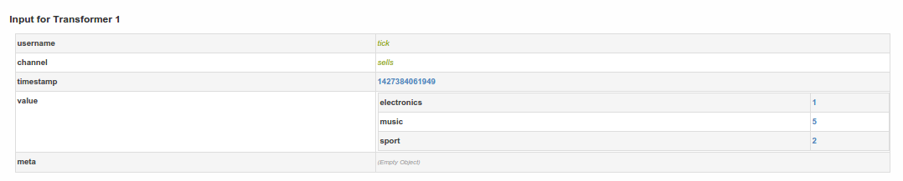
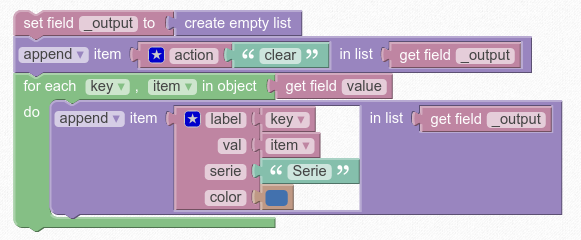
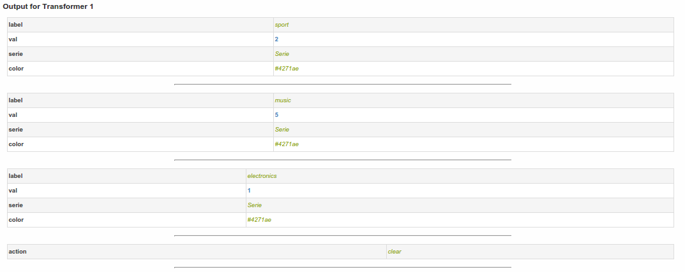

.. _transformer-element:

Transformer
===========

The transformer element receives an event, runs some logic with it and emits
one or more events with the received value and any field added using specific
blocks to add or modify fields.

The logic is done through a visual language.

Multiple Outputs
................

If a single event need to be splitted in multiple ones, you can create an **_output** list and append items to it. 

Loop in array
+++++++++++++

For example, if you have an array called data inside **value**:

You can generate a different output for each item in the array.

Each output will be considered as a different event:

Loop in key/value
+++++++++++++++++

In case you want to create a different output for each key inside **value**

The first item with **action=clear** means that the widget should clear its content before the future events are processed.
