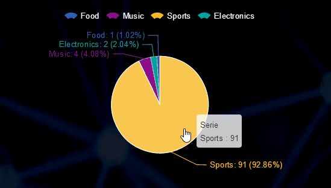
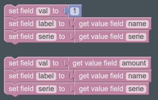
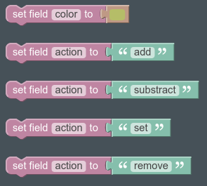

.. _echarts-pie-widget:

Pie Chart
=========

Field Templates
---------------

Required
........

Optional
........

Configuration
-------------

Radius (inner/outer) is useful to convert the pie chart in a donut chart. 

30%,80% means that the inner line will start at 30% and the outer line ends at 80% of the total widget area.

Fields
------

Bold field names are required fields, others are optional.

.. table::

   ==========  ======    ======================================
   Field Name  Type      Description
   ==========  ======    ======================================
   **val**     Number    Number to user for action
   **label**   Text      Identifier for the label of this value
   **serie**   Text      Identifier for the serie of this value
   color       Color     Background color
   action      Text      Name of the action, by default "add"
   ==========  ======    ======================================

Actions
-------

add
...

Increase the value identified by *label* by *val* or 1 if *val* isn't provided.

Useful to accumulate by an identifier.

substract
.........

Decrease the value identified by *label* by *val* or 1 if *val* isn't provided.

set
...

Set the value identified by *label* to *val* or 1 if *val* isn't provided.

remove
......

Removes the value identified by *label* from the displayed values.

Library
-------

http://echarts.baidu.com/index-en.html
