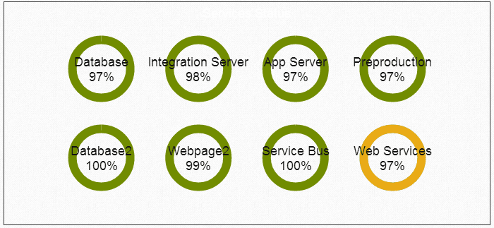
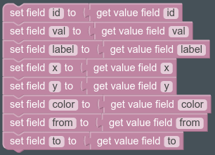
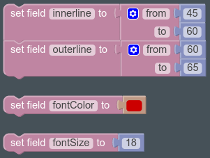

.. _echarts-status-widget:

Status Chart
============

Field Templates
---------------

Required
........

Optional
........

Fields
------

Bold field names are required fields, others are optional.

.. table::

   ==========   ======   ======================================
   Field Name   Type     Description
   ==========   ======   ======================================
   **id**       Text     Identifier of this circle
   **val**      Number   Number to show inside the circle
   **label**    Text     Label to show inside the circle
   **x**        Text     X position of the circle
   **y**        Text     Y position of the circle
   **color**    Color    Background color for the circle
   **from**     Text     Outline start point (0 to 24)
   **to**       Text     Outline end point (0 to 24)
   innerline    Text     Innerline radious from and to
   outerline    Text     Outerline radious from and to
   fontColor    Text     Label color(default white)
   fontSize     Text     Label size(default 15)
   ==========   ======   ======================================

Actions
-------

init
....

Init action only set the val, fontSize and fontColor if it was not setted before.

Library
-------

http://echarts.baidu.com/index-en.html
