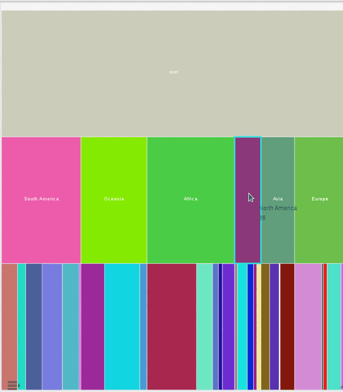
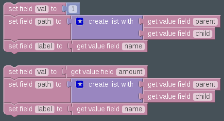
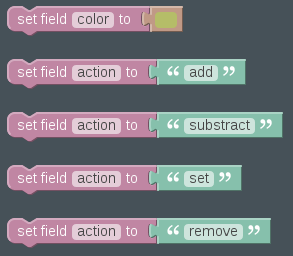

.. _icicle-widget:

Icicle
======

Field Templates
---------------

Required
........

Optional
........

Fields
------

Bold field names are required fields, others are optional.

.. table::

   ==========  ======    =============================================
   Field Name  Type      Description
   ==========  ======    =============================================
   **val**     Number    Number to user for action
   **label**   Text      Text of the node
   **path**    Text      Complete path to the node
   color       Color     Background color
   serie       Text      Text to display below each node of the icicle
   action      Text      Name of the action, by default "add"
   ==========  ======    =============================================

Actions
-------

add
...

Increase the value identified by *label* by *val* or 1 if *val* isn't provided.

Useful to accumulate by an identifier.
    
substract
.........

Decrease the value identified by *label* by *val* or 1 if *val* isn't provided.

set
...

Set the value identified by *label* to *val* or 1 if *val* isn't provided.

remove
......

Removes the value identified by *label* from the displayed values.

Library
-------

http://philogb.github.io/jit/
