.. _widgets:

Widgets
=======

Widgets are visual elements that display data in the dashboard, they can be
resized, moved and can have a title.

Depending on the widget they provide additional actions by right clicking on
them such as filtering, clearing content etc.

Widgets are packaged in extensions, on dashboard creation or edition you can
choose which extensions to load for that dashboard, this means you only load
the widgets and code you need for each dashboard.

3D Widgets Extension
--------------------

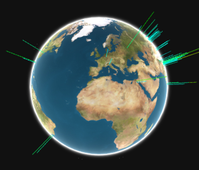

    3D World

Go to :ref:`3d-globe-widget` documentation page

Data Grid Extension
-------------------

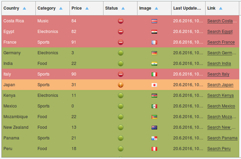

    Data Grid
    App: Data Grid

Go to :ref:`data-grid-widget` documentation page

ECharts App
-----------

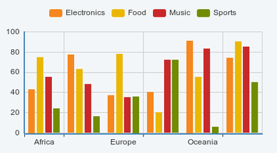

    Bar Chart

Go to :ref:`bar-echarts-widget` documentation page

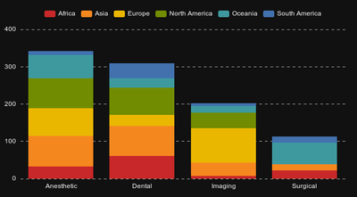

    Bar Chart with stacked option set

Go to :ref:`bar-echarts-widget` documentation page and check the **Stack** option

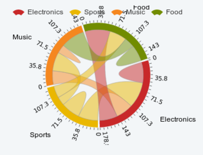

    Chord

Go to :ref:`chord-echarts-widget` documentation page

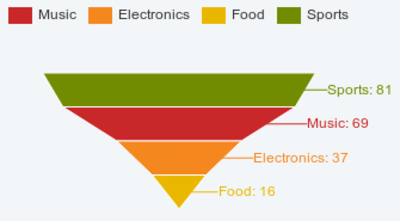

    Funnel

Go to :ref:`funnel-echarts-widget` documentation page

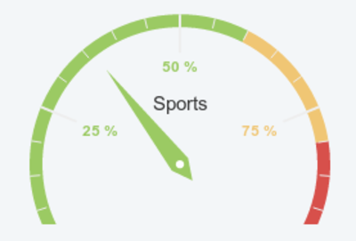

    Gauge

Go to :ref:`gauge-echarts-widget` documentation page

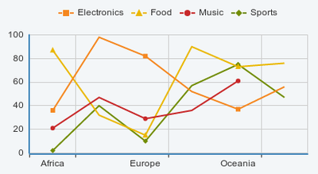

    Line Chart

Go to :ref:`line-echarts-widget` documentation page

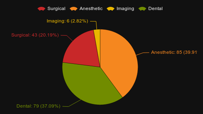

    Pie

Go to :ref:`pie-echarts-widget` documentation page

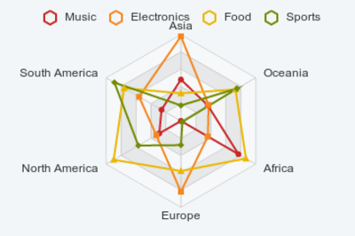

    Radar

Go to :ref:`radar-echarts-widget` documentation page

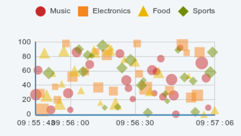

    Scatter Plot

Go to :ref:`scatter-echarts-widget` documentation page

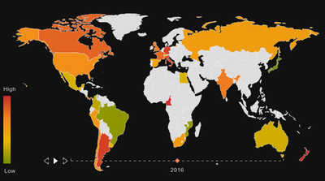

    Time Map

Go to :ref:`time-map-echarts-widget` documentation page

Misc Widgets Extension
----------------------

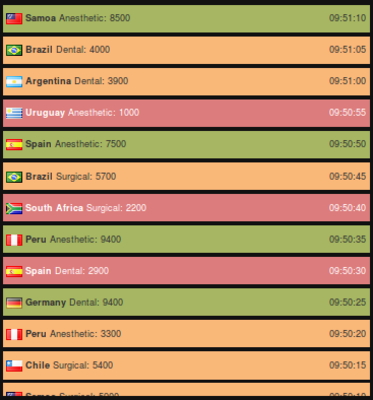

    News Ticker

Go to :ref:`news-ticker-misc-widget` documentation page

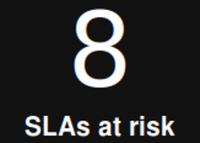

    Odometer

Go to :ref:`odometer-misc-widget` documentation page

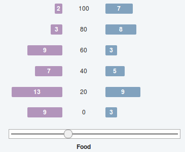

    Odometer

Go to :ref:`piramid-misc-widget` documentation page

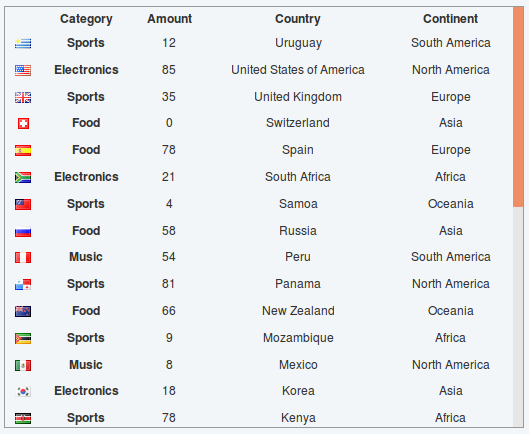

    Odometer

Go to :ref:`table-misc-widget` documentation page

    Template

Go to :ref:`template-misc-widget` documentation page

Open Layers Extension
---------------------

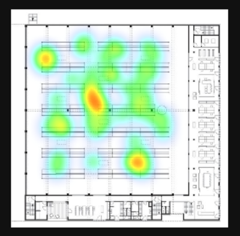

    Image Map

Go to :ref:`image-map-ol-widget` documentation page

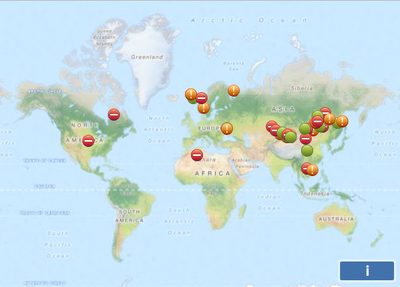

    Map

Go to :ref:`map-ol-widget` documentation page

