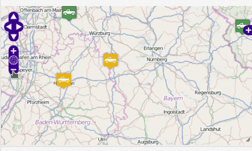
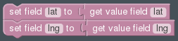
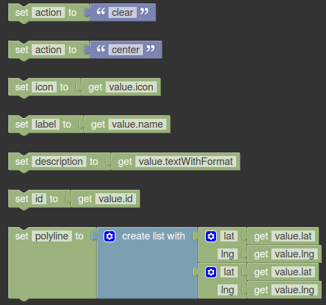

.. _map-widget:

Map
===

Required
........

Optional
........

Fields
------

Bold field names are required fields, others are optional.

.. table::

   ==========  ======   ======================================
   Field Name  Type     Description
   ==========  ======   ======================================
   **lat**     Number   Latitude of the event
   **lng**     Number   Longitude of the event
   icon        Text     Icon to use in the map for the event
   label       Text     Text to show in the info window
   id          Text     Event identifier
   polyline    Set      A set of points to draw a polyline
   action      Text     Name of the action, by default "add"
   ==========  ======   ======================================

If two events are sent with the same id, the last one will replace the first one

Actions
-------

center
......

Center the map at the latitude and longitude specified for the current event

clear
.....

Clear the map before add the new icon to the map

Library
-------

http://mapstraction.com/
