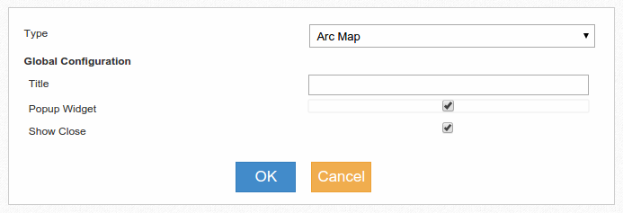
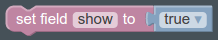
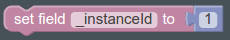

Popup Widgets
=============

Popup widgets are widgets that aren't displayed directly in the dashboard, but
are displayed as a independent overlay window in response to some event.

A Popup widget can be any standard widget, the only difference is that when
selecting the widget you have to check the **Popup Widget** checkbox.

After configuring the widget you won't see it displayed in the dashboard,
that's normal, to display it you need to send one of two specific fields.

Displaying one off Popup Widgets
--------------------------------

If you need to display information in a widget in response to an event but then
you don't need to update the information or it's ok to display the next
interaction in another Popup Widget then you just have to set the **show**
field to **true** in the event that is sent to the widget.

Displaying and updating/reusing a Popup Widget
----------------------------------------------

If you need to display information in a widget in response to an event and then
you want to update the information of the widget in response to other events,
and maybe have more than one popup widget at the same time displayed with a way
to differentitate them then instead of setting the **show** field you set the
**_instanceId** field to any value that will be used to identify the popup
widget unambiguous way.

Then, every time you want to update the content of the popup widget you have
to send the new information with the same **_instanceId** field.

If the user closes the popup and you send an event with a previous
**_instanceId** Event Fabric will reopen the popup dialog with the result of
processing only the last event, as if the Widget was cleared before receiving
the event.
