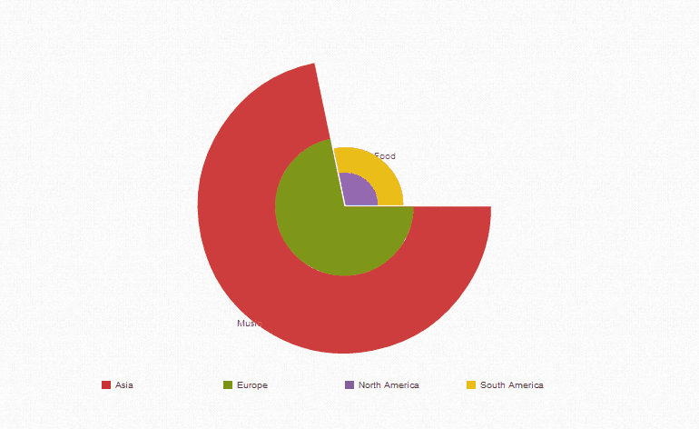

.. _stack-pie-chart-widget:

Stack Pie Chart
===============

Field Templates
---------------

Required
........

.. figure:: ../../img/stack-pie-chart-fields-required.png
   :align: center

Optional
........

.. figure:: ../../img/stack-pie-chart-fields-optional.png
   :align: center

Fields
------

Bold field names are required fields, others are optional.

.. table::

   ==========  =====    ======================================
   Field Name  Type     Description
   ==========  =====    ======================================
   **val**     Text     Value of the category for the specified serie
   **label**   Text     Text of the category
   color       Color    Background color
   serie       Text     Text to display below each stack
   ==========  =====    ======================================

Library
-------

http://philogb.github.io/jit/
