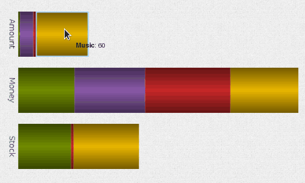
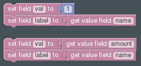
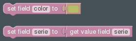

.. _stack-widget:

Stack Chart
===========

Field Templates
---------------

Required
........

Optional
........

Fields
------

Bold field names are required fields, others are optional.

.. table::

   ==========  =====    ======================================
   Field Name  Type     Description
   ==========  =====    ======================================
   **val**     Text     Value to use according to action
   **label**   Text     Text to display below the stack
   color       Color    Background color
   action      Text     Name of the action, by default "set"
   ==========  =====    ======================================

Library
-------

http://philogb.github.io/jit/
