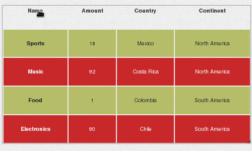
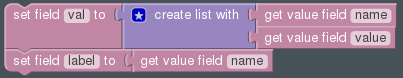
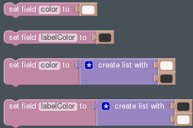

.. _table-widget:

Table
=====

Field Templates
---------------

Required
........

Optional
........

Fields
------

Bold field names are required fields, others are optional.

.. table::

   ==========   ======    ======================================
   Field Name   Type      Description
   ==========   ======    ======================================
   **val**      List      List of columns for the row
   **label**    Text      Identifier for the row
   color        Color     Background color
   labelcolor   Color     Text color
   ==========   ======    ======================================

In this widget *color* and *labelColor* can either be a color (applies to all
the columns of the row) or a list of colors (one color for each column).

If a list of colors is specified leaving a column empty uses the default color
for that column.
