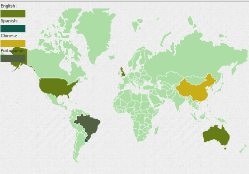
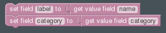

.. _thematic-map-widget:

Thematic Map
============

Field Templates
---------------

Required
........

Optional
........

Fields
------

Bold field names are required fields, others are optional.

.. table::

   ============  ========  =============================================
   Field Name    Type      Description
   ============  ========  =============================================
   **label**     Text      Country/State code(A 3)
   **category**  Text      Category to which the country belongs
   color         Color     Category Color(it can be setted globally too)
   ============  ========  =============================================

Label
-----

Examples: USA, ARG, DEU, CHI, ITA

Library
-------

https://github.com/markmarkoh/datamaps
